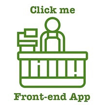
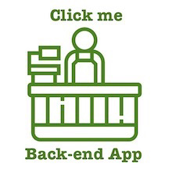
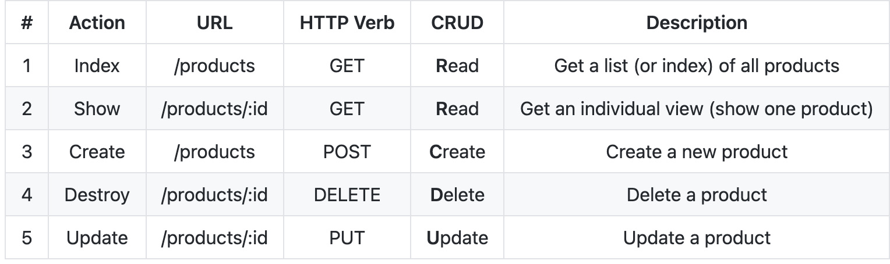

# Online Bodega
## Full Stack Store App

- Built back-end with `express` and `pg-promise`, where it uses a `postgres` database
- Built front-end with `create-react-app` 
- The app is deployed on heroku and can be accessed from React front-end app and Postman

 

## Implemented User Stories

1. A user can see a list of products to buy
1. A user can click on the new button that takes me to a new form that lets the user create a new product
1. After clicking the submit button on the new form, it takes the user back to the index page
1. A user can click on a product and see a detailed view
1. A user can, from the detailed view, delete a product
1. A user can, from the detailed view click on an edit button and see an edit form
1. After clicking the submit button on the edit form, it will return the user back to the updated detail view
1. A user can visit this app on the internet that uses data from the express API
1. A user can share the link to the new page (once my apps are hosted online) and someone else will be able to see a specific view
1. A user can view this app on a desktop or phone and it is easy to read/use (the app has some responsive design)
1. **Bonus** A user can filter products (implemented in front-end)
1. **Bonus** A user can, from the detailed view, read and post product reviews. 

## Back-end Routes

## Collaborators
- [Teyanna Earle](https://github.com/teyannaearle)
- [Angelina Ebreo](https://github.com/angelinaebreo)
- [Yesenia Lopez Rodriguez](https://github.com/ylopez25)
- [Jonathan Narine](https://github.com/jonnicwolf)
